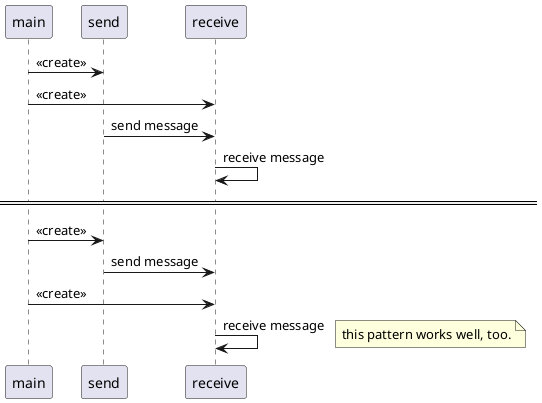

```puml
@startuml

main -> send : <<create>>
main -> receive : <<create>>
send -> receive : send message
receive -> receive : receive message

====
main -> send : <<create>>
send -> receive : send message
main -> receive : <<create>>
receive -> receive : receive message
note right : this pattern works well, too.
@enduml
```
